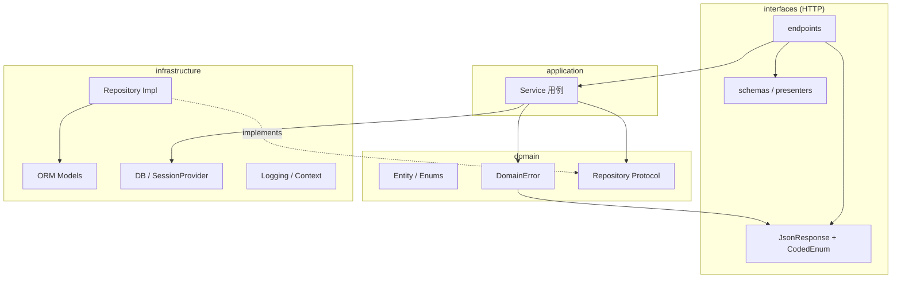

# AI Agent 指南

本文档帮助 Cursor 等 AI 助手快速理解 **agent** 并在正确分层下改代码。人类开发者也可作为 onboarding 参考。

## 项目是什么

基于 FastAPI 的 **DDD 后端项目 agent**（v0.1.0）：配置管理、异步 SQLAlchemy、Alembic 迁移、统一 JSON 响应、日志与中间件。User 模块是完整的垂直切片示例。

## 改代码前先读

| 文档 | 用途 |
|------|------|
| [README.md](README.md) | 安装、配置、迁移、响应码、Roadmap |
| [.cursor/rules/](.cursor/rules/) | 持久化 AI 规则（`python.mdc` + `scaffold.mdc` + `http-api.mdc`） |
| `.env.sample` | 环境变量命名空间 |

## 架构一图



## 依赖规则（必须遵守）

1. **domain** 不 import `app.interfaces` 或 `app.infrastructure`
2. **application** 可 import domain；通过 `SessionProvider` + 仓储实现访问 DB，不直接写 SQL 在 Service 外
3. **interfaces** 调 application Service；Entity 转 HTTP 响应走 **presenter**
4. **ORM Model** 只在 `infrastructure/persistence/models/`

## 新增 REST 模块清单

以 `user` 为模板，按顺序创建：

| 步骤 | 路径 |
|------|------|
| 领域实体与接口 | `app/domain/{name}/entity.py`, `enums.py`, `exceptions.py`, `repository.py` |
| ORM + 仓储实现 | `app/infrastructure/persistence/models/{name}.py`, `repositories/{name}.py` |
| 注册 Model | `app/infrastructure/persistence/registry.py` 增加 import |
| 应用服务 | `app/application/{name}/service.py` |
| HTTP DTO | `app/interfaces/http/schemas/requests|responses/{name}.py` |
| 转换 | `app/interfaces/http/presenters/{name}.py` |
| 依赖 | `app/interfaces/http/deps/{name}.py` |
| 路由 | `app/interfaces/http/api/v1/endpoints/{name}.py` |
| 挂载 | `app/interfaces/http/api/v1/router.py` |
| 异常映射 | `app/interfaces/http/handlers/domain_error.py` |
| 迁移 | `alembic -c database/alembic.ini revision --autogenerate -m "..."` |

## 常用命令

```bash
uv sync                          # 安装依赖
cp .env.sample .env              # 环境变量
uv run python -m app.main        # 启动
uv run black . && uv run ruff check .  # 格式化与 lint
```

## AI 修改原则

- **最小 diff**：只改任务相关文件，不顺手重构
- **匹配现有风格**：User 模块即标准答案
- **不跳过层**：不在 endpoint 里写 SQLAlchemy 查询
- **配置走 config/**：新 env 变量加对应 `*Config` 与 `.env.sample` 说明
- **响应统一 JsonResponse**：不返回裸 dict（`/health` 除外）
- **Roadmap 未完成项**：改全局异常 handler 前先读 `handlers/register.py` 现有注册

## 关键入口文件

- 应用入口：`app/main.py`
- 路由注册：`app/interfaces/http/routers/register.py`
- 中间件：`app/interfaces/http/middleware/register.py`
- 配置聚合：`config/config.py`
- DB 门面：`app/infrastructure/database/db.py`
