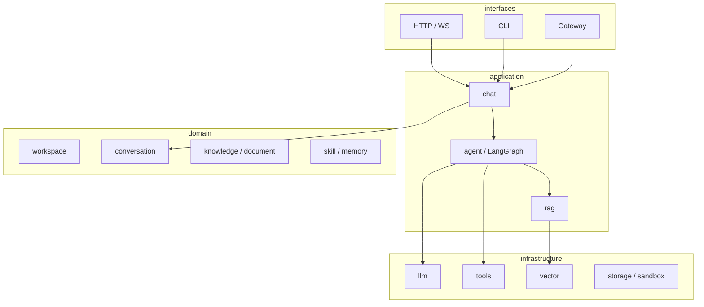

# AI Agent 指南

本文档帮助 Cursor 等 AI 助手快速理解 **agent** 项目并在正确分层下改代码。

## 项目是什么

**Agent-only 运行时**（v0.2.0）：个人 Agent + 线上 API 统一服务。FastAPI 暴露 HTTP/WS，LangGraph 负责编排，支持 RAG、Skills、Memory。

## 改代码前先读

| 文档 | 用途 |
|------|------|
| [README.md](README.md) | 安装、配置、Roadmap |
| [.cursor/rules/](.cursor/rules/) | `python.mdc` + `scaffold.mdc` + `http-api.mdc` |
| `.env.sample` | 环境变量命名空间 |

## 架构一图



## 依赖规则

1. **domain** 不 import `app.interfaces` 或 `app.infrastructure`
2. **application/chat** 是对外用例门面；**application/agent** 只做 LangGraph 编排
3. **interfaces** 调 application，Entity 转 DTO 走 presenter
4. LangChain / LangGraph 只在 `application/agent` 与 `infrastructure/` 出现

## 新增能力清单

| 步骤 | 路径 |
|------|------|
| 领域模型 | `app/domain/{name}/` |
| 用例 | `app/application/chat/` 或 `agent/` / `rag/` |
| 适配器 | `app/infrastructure/{llm,tools,vector,storage,sandbox}/` |
| HTTP | `interfaces/http/schemas/` + `presenters/` + `deps/` + `endpoints/` |
| 异常映射 | `handlers/domain_error.py` |

## 常用命令

```bash
uv sync
cp .env.sample .env
uv run python -m app.main              # HTTP/WS 服务
uv run python -m app.interfaces.cli    # 个人 CLI
uv run black . && uv run ruff check .
```

## AI 修改原则

- **最小 diff**：只改任务相关文件
- **Agent 优先**：不为通用 CRUD 模式引入无关抽象
- **不跳过层**：endpoint 不直接调 LangGraph
- **配置走 config/**：新 env 加 `*Config` 与 `.env.sample`
- **部署模式**：改工具权限时同时考虑 `personal` / `server`

## 关键入口

- Web 入口：`app/main.py`
- 路由注册：`app/interfaces/http/routers/register.py`
- 配置聚合：`config/config.py`
- Agent 编排（待实现）：`app/application/agent/`
