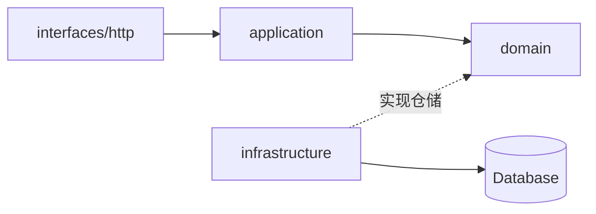

# agent

基于 FastAPI 的 **DDD** 后端项目：配置管理、异步数据库、领域分层、统一 API 响应、日志与 Alembic 迁移。

> **当前状态：v0.1.0** — User 模块已打通全链路（domain → application → HTTP → persistence）；全局异常 handler、测试与 CI 待补全。

## 文档导航

| 读者 | 文档 |
|------|------|
| 新成员 / 运维 | 本文 README（安装、配置、迁移） |
| AI 助手 | [AGENTS.md](AGENTS.md) + [.cursor/rules/](.cursor/rules/) |
| 编码规范 | `.cursor/rules/python.mdc`、`scaffold.mdc`、`http-api.mdc` |

## 技术栈

| 类别 | 选型 |
|------|------|
| 语言 | Python 3.14+ |
| Web | FastAPI + Uvicorn |
| 配置 | pydantic-settings |
| ORM | SQLAlchemy 2.x（asyncio） |
| 数据库驱动 | aiomysql / aiosqlite / asyncpg |
| 包管理 | [uv](https://docs.astral.sh/uv/) |

## 快速开始

### 1. 环境准备

```bash
uv sync
cp .env.sample .env
```

### 2. 启动服务

```bash
uv run python -m app.main
# 或
uv run uvicorn app.main:app --host 0.0.0.0 --port 8000 --reload
```

- 健康检查：[http://127.0.0.1:8000/health](http://127.0.0.1:8000/health)
- User API 示例：[http://127.0.0.1:8000/api/v1/users](http://127.0.0.1:8000/api/v1/users)
- OpenAPI 文档：[http://127.0.0.1:8000/docs](http://127.0.0.1:8000/docs)

## 架构概览



**依赖方向**：`interfaces → application → domain`；`infrastructure` 实现 domain 接口，ORM 位于 `persistence/models/`。

## 目录结构

```
agent/
├── paths.py                         # BASE_DIR、ENV_FILE、DATABASE_DIR
├── AGENTS.md                        # AI 助手 onboarding
├── config/                          # 配置（各域 *Config + config() 聚合）
│   ├── settings.py                  # BASE_SETTINGS_CONFIG 公共项
│   ├── app.py / database.py / logging.py / cors.py
│   └── config.py                    # config() 入口
├── app/
│   ├── main.py                      # FastAPI 入口 + lifespan
│   ├── domain/                      # 领域：实体、枚举、异常、仓储 Protocol
│   │   └── user/                    # 示例模块
│   ├── application/                 # 应用层：用例 Service
│   │   ├── user/
│   │   └── support/                 # 分页、ULID 等横切工具
│   ├── interfaces/http/             # HTTP 接口层
│   │   ├── api/v1/endpoints/        # REST 路由（/api/v1/...）
│   │   ├── ws/v1/                   # WebSocket（待扩展）
│   │   ├── deps/                    # FastAPI Depends 注入
│   │   ├── handlers/                # 异常 handler
│   │   ├── middleware/              # 中间件
│   │   ├── presenters/              # Entity → Response DTO
│   │   ├── schemas/                 # Request / Response Pydantic 模型
│   │   ├── support/response/        # JsonResponse + 响应码表
│   │   └── routers/register.py      # 路由总注册
│   └── infrastructure/
│       ├── context/                 # RequestScope / trace_id
│       ├── database/                # 连接管理、SessionProvider
│       ├── logging/                 # LogManager
│       └── persistence/             # ORM Model、仓储实现、registry
└── database/                        # Alembic 迁移
    ├── alembic.ini
    └── migrations/
```

## 新增业务模块

以 **User** 为模板，完整步骤见 [AGENTS.md](AGENTS.md#新增-rest-模块清单)。核心流程：

1. 在 `domain/{name}/` 定义实体、异常与 `Repository` Protocol
2. 在 `infrastructure/persistence/` 实现 Model 与仓储，并在 `registry.py` 注册
3. 在 `application/{name}/service.py` 编写用例（`SessionProvider` 管理事务）
4. 在 `interfaces/http/` 添加 schemas、presenter、deps、endpoint，并挂载到 `api/v1/router.py`
5. 在 `handlers/domain_error.py` 映射领域异常 → `ErrorCode`
6. 执行 Alembic 生成并应用迁移

## 配置说明

环境变量模板见 [`.env.sample`](.env.sample)：

| 前缀 | 模块 | 说明 |
|------|------|------|
| `APP_` | `config/app.py` | 应用名、环境、调试、端口、**服务码**（三位数字） |
| `DB_` | `config/database.py` | 默认连接名、连接池、各命名连接参数（不含 URL） |
| `LOG_` | `config/logging.py` | 级别、驱动、JSON 格式、轮转 |
| `CORS_` | `config/cors.py` | 跨域策略 |

代码中读取配置：

```python
from config.config import config

configure = config()
configure.app.name
configure.database.connection
```

各域配置共享 `config/settings.py` 中的 `BASE_SETTINGS_CONFIG`，再设置各自的 `env_prefix`：

```python
from pydantic_settings import SettingsConfigDict
from config.settings import BASE_SETTINGS_CONFIG

model_config = SettingsConfigDict(**BASE_SETTINGS_CONFIG, env_prefix="APP_")
```

## 开发约定

项目根目录 [.cursor/rules/](.cursor/rules/) 供 AI 与团队统一遵循：

| 规则文件 | 范围 | 内容 |
|----------|------|------|
| `python.mdc` | 全局 | Python 3.14+ 语法、显式导入、`__init__.py` 不做 re-export、Session |
| `scaffold.mdc` | 全局 | DDD 分层、配置、响应码、日志、路由、数据库、当前进度 |
| `http-api.mdc` | `interfaces/http/**` | Presenter/Deps 模式、中间件顺序、领域异常映射 |

核心原则：

- 新建包目录添加**空** `__init__.py`，禁止 re-export
- 从定义所在模块显式导入，例如 `from config.database import DatabaseConfig`
- 配置公共项放 `config/settings.py`，聚合放 `config/config.py`
- 包内模块用 `python -m` 运行，避免 `python config/xxx.py` 导致包名冲突

## 数据库连接

设计参考 Laravel `Illuminate\Database`：配置层只定义 `connections`，URL 在 Connector 中组装。

```
config/database.py → connections / configuration(name)
                 → Connector.make_url() → ConnectionFactory → Connection
```

连接名与驱动解耦（`mysql`、`pgsql`、`sqlite` 为连接名，同驱动可配置多个连接）。

```python
from app.infrastructure.database.db import DB

async with DB.connection() as session:        # 默认连接
    ...

async with DB.connection("sqlite") as session:
    ...
```

应用层推荐通过 `SessionProvider` 获取 session（见 `application/user/service.py`）。

### 迁移（Alembic）

在项目根目录执行：

```bash
# 创建迁移
alembic -c database/alembic.ini revision --autogenerate -m "add_xxx_table"

# 应用到最新
alembic -c database/alembic.ini upgrade head

# 当前版本
alembic -c database/alembic.ini current

# 历史
alembic -c database/alembic.ini history

# 回滚一步
alembic -c database/alembic.ini downgrade -1

# 回滚到指定 revision
alembic -c database/alembic.ini downgrade <revision_id>

# 回滚到最初
alembic -c database/alembic.ini downgrade base
```

`database/migrations/env.py` 通过 `sync_url()` 读取连接，与 `config/database.py` 保持一致。Model 在 `registry.py` 导入后，`--autogenerate` 可检测变更。

### 持久化 Model

ORM 属于基础设施，放在 `infrastructure/persistence/models/`：

```python
from app.domain.user.enums import UserStatus
from app.infrastructure.database.orm.base import Base

class User(Base):
    __tablename__ = "users"
    ...
```

在 `persistence/registry.py` 导入后，Alembic `--autogenerate` 可检测变更。

## 日志

基建：`configure_logging()` → `LogManager` 读 `LoggingConfig.channels`；各层使用 `logging.getLogger(__name__)`。

- **路径**：各通道在 `config/logging.py` → `LoggingConfig.channels` 定义（默认 `storage/logs/{APP_NAME}/`）
- **文件**：`app.log`（业务）、`request.log`（访问）、`db.log`（SQL）、`exception.log`
- **级别**：`LOG_LEVEL` 控制所有通道与控制台
- **格式**：`LOG_JSON=false` 文本行；`LOG_JSON=true` 单行 JSON
- **trace_id**：`RequestScopeMiddleware` + `TraceIdFilter`；访问日志与 `JsonResponse` 均带出
- **轮转**：`LOG_DRIVER=single|daily|rotating`

常用 logger：`__name__`（应用）、`app.request`（HTTP）、`app.channel.exception`（领域异常）。

## 统一 API 响应

对外 JSON 由 `app/interfaces/http/support/response/json.py` 的 `JsonResponse` 定义：

| 字段 | 说明 |
|------|------|
| `code` | 10 位字符串响应码 |
| `success` | 是否成功（模型字段 `is_success`） |
| `message` | 提示文案 |
| `data` | 业务数据，可为 `null` |
| `trace_id` | 链路 ID |

### 10 位响应码

格式：`[HTTP 3位][服务码 3位][低位 4位]`

```
200 + 001 + 0000  →  "2000010000"   # 请求成功
404 + 001 + 0102  →  "4040010102"   # 数据不存在
```

- **低位 4 位**在码表中定义（`CodeDefinition.code`）
- **服务码**来自 `APP_SERVICE_CODE`（默认 `001`）
- 完整码由 `CodedEnum.full_code()` 自动组装

### 码表

位于 `app/interfaces/http/support/response/code/`：

| 文件 | 说明 |
|------|------|
| `contract.py` | `CodeDefinition`、`CodedEnum` 基类 |
| `success_code.py` | `SuccessCode` |
| `error_code.py` | `ErrorCode` |

```python
from app.interfaces.http.support.response.json import JsonResponse
from app.interfaces.http.support.response.code.error_code import ErrorCode
from app.interfaces.http.support.response.code.success_code import SuccessCode

return JsonResponse.success(data={"id": 1})
return JsonResponse.success(data=user, code=SuccessCode.SUCCESS_CREATED)
return JsonResponse.error(code=ErrorCode.NOT_FOUND_ERROR, message="用户不存在")
```

### 业务错误分层

- **领域语义**：`domain/` 或 `application/` — `DomainError` 子类，不含 HTTP / 服务码
- **对外码表**：`interfaces/http/support/response/code/` — `SuccessCode`、`ErrorCode` 及模块扩展
- **映射**：`handlers/domain_error.py` 将领域异常转为 `ErrorCode`，再 `JsonResponse.error(...)`

## HTTP 路由

```
/api/v1/users/...   ← api/v1/endpoints/user.py
/ws/v1/...          ← ws/v1/（待扩展）
```

注册链：`main.py` → `routers/register.py` → `api/router`（`/api`）→ `v1/router`（`/v1`）

- 新 REST：在 `api/v1/endpoints/` 增加模块并在 `api/v1/router.py` 挂载
- 新 WebSocket：在 `ws/v1/endpoints/` 增加模块并在 `ws/v1/router.py` 挂载
- 路由保持薄：Depends 注入 Service → Presenter 转 DTO → `JsonResponse`

## Roadmap

- [x] 数据库连接层（DatabaseManager / Connectors / DB Facade）
- [x] `lifespan` disconnect
- [x] DDD 目录骨架 + User ORM
- [x] 统一 API 响应（`JsonResponse` + `CodedEnum`）
- [x] HTTP 路由分包（`api/v1`、`ws/v1`）
- [x] domain 实体 / 仓储接口（User）
- [x] application 用例（UserService）
- [x] 领域异常 handler（`DomainError` → `JsonResponse.error`）
- [x] 中间件（RequestScope / CORS / request_log 等）
- [x] 日志（LogManager + channels + request.log）
- [x] AI / 团队文档（AGENTS.md + Cursor rules）
- [ ] 全局异常 handler 补全（422 校验 / 500 未捕获 / `HTTPException`）
- [ ] 测试与 CI

## 开发工具

```bash
uv run black .
uv run ruff check .
uv sync --extra dev   # 可选开发依赖（pytest、black、ruff）
```
