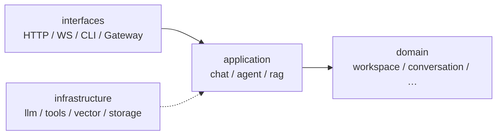

# agent

**Agent-only 运行时**：个人 Agent + 线上 API 统一服务。FastAPI 暴露 HTTP/WebSocket，LangGraph 负责 Agent 编排，支持 RAG、Skills、Memory。

> **当前状态：v0.2.0** — 对话、会话、工具、CLI、RAG、Skills、Memory、Telegram Gateway 已可用。

## 文档导航

| 读者 | 文档 |
|------|------|
| 开发者 | 本文 README |
| AI 助手 | [AGENTS.md](AGENTS.md) + [.cursor/rules/](.cursor/rules/) |
| 环境变量 | `.env.sample` |

## 技术栈

| 类别 | 选型 |
|------|------|
| 语言 | Python 3.14+ |
| Web | FastAPI + Uvicorn |
| Agent | LangGraph / LangChain（待接入） |
| 配置 | pydantic-settings |
| 向量 | pgvector / Qdrant（待接入） |
| 包管理 | [uv](https://docs.astral.sh/uv/) |

## 快速开始

```bash
uv sync
cp .env.sample .env
uv run python -m app.main          # HTTP/WS 服务
uv run python -m app.interfaces.cli # 个人 CLI（交互式）
uv sync --extra gateway              # 安装 Telegram 依赖
uv run python -m app.interfaces.gateway # Telegram Gateway（需配置 BOT_TOKEN）
```

- 健康检查：[http://127.0.0.1:8000/health](http://127.0.0.1:8000/health)
- OpenAPI：[http://127.0.0.1:8000/docs](http://127.0.0.1:8000/docs)

## 架构概览



**依赖方向**：`interfaces → application → domain`；`infrastructure` 为 application 提供适配器。

## 目录结构

```
agent/
├── config/
│   ├── app.py              # deployment_mode
│   ├── llm.py              # 模型、API Key
│   ├── agent.py            # 工具开关、迭代上限
│   └── rag.py              # chunk、top_k、向量库
├── app/
│   ├── domain/
│   │   ├── workspace/      # 租户边界
│   │   ├── conversation/   # 会话、消息
│   │   ├── document/       # 文档、分块
│   │   ├── knowledge/      # 知识库
│   │   ├── skill/          # 技能
│   │   └── memory/         # 长期记忆
│   ├── application/
│   │   ├── agent/          # LangGraph 编排
│   │   ├── rag/            # 入库、检索
│   │   └── chat/           # 对话用例
│   ├── infrastructure/
│   │   ├── llm/            # ChatModel
│   │   ├── vector/         # 向量库
│   │   ├── document/       # 文档 loader
│   │   ├── tools/          # web、file、terminal…
│   │   ├── storage/        # 本地 / S3
│   │   └── sandbox/        # 代码隔离
│   └── interfaces/
│       ├── http/           # REST + WS
│       ├── cli/            # 个人模式
│       └── gateway/        # 消息平台（后期）
└── storage/                # 运行时数据（gitignore）
```

## 部署模式

| 模式 | 环境变量 | 说明 |
|------|----------|------|
| 个人 | `APP_DEPLOYMENT_MODE=personal` | 本地 CLI/API，全工具 |
| 线上 | `APP_DEPLOYMENT_MODE=server` | API Key 鉴权，沙箱工具 |

## 配置

```python
from config.config import config
configure = config()
```

| 前缀 | 模块 | 说明 |
|------|------|------|
| `APP_` | `config/app.py` | 应用、端口、`deployment_mode` |
| `LLM_` | `config/llm.py` | 模型、API Key |
| `AGENT_` | `config/agent.py` | 迭代上限、toolset |
| `RAG_` | `config/rag.py` | 分块、向量库 |
| `MEMORY_` | `config/memory.py` | 长期记忆上限、分隔符 |
| `SKILLS_` | `config/memory.py` | Skills 目录开关 |
| `LOG_` | `config/logging.py` | 日志 |
| `CORS_` | `config/cors.py` | 跨域 |

## API 路由

| 方法 | 路径 | 说明 |
|------|------|------|
| `GET` | `/api/v1/agent/tools` | 当前可用工具列表 |
| `POST` | `/api/v1/chat` | 发送消息（`conversation_id` 可选） |
| `GET` | `/api/v1/chat/models/options` | 静态可选模型列表 |
| `POST` | `/api/v1/conversations` | 创建会话 |
| `GET` | `/api/v1/conversations` | 会话列表 |
| `GET` | `/api/v1/conversations/{id}` | 会话详情 + 消息 |
| `DELETE` | `/api/v1/conversations/{id}` | 删除会话 |
| `GET` | `/api/v1/skills` | 技能列表 |
| `GET` | `/api/v1/skills/{name}` | 技能详情 |
| `PUT` | `/api/v1/skills/{name}` | 创建或更新技能 |
| `GET` | `/api/v1/memory` | 记忆快照（memory + user） |
| `POST` | `/api/v1/memory/entries` | 新增记忆条目 |
| `DELETE` | `/api/v1/memory/entries/{id}` | 删除记忆条目 |
| `WS` | `/ws/v1/chat` | 流式对话（JSON 事件） |

### POST /api/v1/chat 示例

```json
{
  "message": "你好",
  "conversation_id": "可选，不传则自动创建",
  "model": {
    "provider": "zhipu",
    "model": "glm-4.7"
  }
}
```

模型优先级：**请求 `model` > 会话绑定 model > config 默认（`LLM_PROVIDER` / `LLM_MODEL`）**。

有 `conversation_id` 时从 SQLite 加载历史，忽略请求里的 `history`。

### 多轮对话示例

```bash
# 1. 创建会话（可选，chat 不传 conversation_id 也会自动创建）
curl -X POST http://127.0.0.1:8000/api/v1/conversations -H "Content-Type: application/json" -d '{"title":"我的对话"}'

# 2. 第一轮
curl -X POST http://127.0.0.1:8000/api/v1/chat -H "Content-Type: application/json" -d '{"message":"记住42","conversation_id":"<id>"}'

# 3. 第二轮（自动读历史）
curl -X POST http://127.0.0.1:8000/api/v1/chat -H "Content-Type: application/json" -d '{"message":"刚才的数字是？","conversation_id":"<id>"}'
```

数据存储：`storage/agent.sqlite`（SQLite）

### 工具（file / web / terminal）

默认 **personal + full** 启用全部 toolset；工作目录为 `storage/workspace/`。

| toolset | 工具 | 说明 |
|---------|------|------|
| `file` | `read_file`, `list_directory`, `write_file`* | 路径相对 workspace，禁止目录穿越 |
| `web` | `fetch_webpage` | 抓取公开 HTTP/HTTPS 页面文本 |
| `rag` | `search_knowledge` | 检索已入库知识库 |
| `memory` | `memory` | 管理长期记忆 / 用户画像 |
| `skills` | `skills_list`, `skill_view` | 列出并按需加载 Skills |
| `session` | `session_search` | 搜索历史会话消息 |
| `todo` | `todo` | 跟踪 Agent 当前工作清单 |
| `terminal` | `run_terminal_command` | 仅 personal + full，在 workspace 下执行 shell；默认阻断高风险命令 |

\* `write_file` 在 `readonly` 策略下不可用。

```bash
# 查看当前可用工具
curl http://127.0.0.1:8000/api/v1/agent/tools
```

相关 env：`AGENT_DEFAULT_TOOL_POLICY`、`AGENT_ENABLED_TOOLSETS`、`AGENT_DISABLED_TOOLSETS`、`AGENT_DANGEROUS_COMMAND_POLICY`（见 `.env.sample`）。

### Hermes-style 上下文

Agent 会将项目上下文注入系统提示词：优先加载 `.hermes.md` / `HERMES.md`，其次是 `AGENTS.md`、`CLAUDE.md`、`.cursorrules` 或 `.cursor/rules/*.mdc`。上下文文件会做基础注入风险扫描与长度截断；可用 `AGENT_CONTEXT_FILES_ENABLED=false` 关闭。

### 短时记忆（上下文压缩）

长会话会从 SQLite 加载历史并注入 Agent。为避免超过模型 context window，默认启用 LangChain **`SummarizationMiddleware`**：

- 消息数 ≥ `AGENT_SUMMARIZATION_TRIGGER_MESSAGES`（默认 40）时，自动摘要旧消息
- 保留最近 `AGENT_SUMMARIZATION_KEEP_MESSAGES`（默认 20）条
- 从 DB 加载时最多取 `AGENT_MAX_HISTORY_MESSAGES`（默认 200）条

可选：`AGENT_SUMMARIZATION_TRIGGER_TOKENS`、`AGENT_SUMMARIZATION_TRIGGER_FRACTION`；摘要模型默认同对话模型，可用 `AGENT_SUMMARIZATION_PROVIDER` / `AGENT_SUMMARIZATION_MODEL` 指定更便宜的模型（如 `glm-4-flash`）。

### RAG 知识库

personal 模式默认 **SQLite 向量存储** + 智谱 `embedding-3`（需 `ZHIPUAI_API_KEY`）。

| 方法 | 路径 | 说明 |
|------|------|------|
| `POST` | `/api/v1/knowledge-bases` | 创建知识库 |
| `GET` | `/api/v1/knowledge-bases` | 列表 |
| `POST` | `/api/v1/knowledge-bases/{id}/documents` | 入库（`content` 或 `file_path`） |
| `POST` | `/api/v1/knowledge-bases/{id}/search` | 向量检索 |
| `GET` | `/api/v1/documents/{id}` | 文档详情 |

Agent 工具：`search_knowledge`（toolset `rag`，默认启用）

```bash
# 创建知识库并入库
curl -X POST http://127.0.0.1:8000/api/v1/knowledge-bases -H "Content-Type: application/json" -d '{"name":"my-kb"}'
curl -X POST http://127.0.0.1:8000/api/v1/knowledge-bases/<kb_id>/documents \
  -H "Content-Type: application/json" \
  -d '{"title":"readme","content":"The secret code is RAG-42."}'

# 检索
curl -X POST http://127.0.0.1:8000/api/v1/knowledge-bases/<kb_id>/search \
  -H "Content-Type: application/json" -d '{"query":"secret code"}'
```

RAG env：`RAG_EMBEDDING_PROVIDER=zhipu`、`RAG_EMBEDDING_MODEL=embedding-3`、`RAG_EMBEDDING_DIMENSIONS=1024`

### Skills + Memory

**Skills** 采用 [agentskills.io](https://agentskills.io) 风格：在 `storage/skills/**/SKILL.md` 放置带 YAML frontmatter 的 Markdown。System prompt 只注入技能索引（渐进式披露），Agent 通过 `skill_view` 按需加载完整说明。

**Memory** 使用 SQLite `memory_entries` 表，替代 Hermes 的 MEMORY.md / USER.md。启动时 frozen snapshot 注入 system prompt；Agent 可通过 `memory` 工具增删改。

| toolset | 工具 | 说明 |
|---------|------|------|
| `skills` | `skills_list`, `skill_view` | 列出 / 加载技能 |
| `memory` | `memory` | `add` / `replace` / `remove`，target 为 `memory` 或 `user` |

```bash
# 技能列表
curl http://127.0.0.1:8000/api/v1/skills

# 新增用户画像
curl -X POST http://127.0.0.1:8000/api/v1/memory/entries \
  -H "Content-Type: application/json" \
  -d '{"target":"user","content":"Preferred language: 中文"}'

# 查看记忆快照
curl http://127.0.0.1:8000/api/v1/memory
```

示例技能：`storage/skills/demo/SKILL.md`

### Gateway（Telegram）

Telegram Bot 复用 `ChatService`，每个 chat 绑定一个 `conversation_id`（存 SQLite `gateway_bindings`）。

```bash
uv sync --extra gateway
# .env 中设置 GATEWAY_TELEGRAM_ENABLED=true 与 GATEWAY_TELEGRAM_BOT_TOKEN
uv run python -m app.interfaces.gateway
```

Bot 命令：`/start` `/help` `/new` `/conv`；普通文本走 Agent 对话（默认流式 edit 回复）。

**安全**：`GATEWAY_TELEGRAM_ALLOWED_CHAT_IDS` 白名单；`server` 模式下白名单为空则拒绝所有 chat。

### CLI 个人模式（Hermes 风格 TUI）

底部固定输入 + 上方滚动输出，复用 `ChatService`。

```bash
# 交互式 TUI（默认）
uv run python -m app.interfaces.cli

# 单条消息
uv run python -m app.interfaces.cli -m "你好"

# 纯 readline 模式（无 TUI）
uv run python -m app.interfaces.cli --plain
```

**交互风格**（对齐 hermes-agent）：
- 输入提示 `❯`，Agent 忙碌时 `⚕`
- 用户消息：`●` + 分隔线
- 助手回复：流式圆角框 `╭─ ⚕ Agent ─╮`
- Enter 发送，Alt+Enter / Ctrl+J 换行，Ctrl+D 退出

REPL 命令：`/help` `/new` `/conv` `/model` `/tools` `/models` `/exit`

### WebSocket 流式 `/ws/v1/chat`

> **注意**：浏览器请访问 `GET /ws/v1/chat/info` 查看说明；  
> 流式对话必须用 **WebSocket** 连接 `/ws/v1/chat`（不要用普通 GET）。

连接后发送一条 JSON（字段同 REST `ChatRequest`），服务端按序推送事件：

```json
{"event": "start", "data": {"provider": "zhipu", "model": "glm-4.7", "trace_id": "..."}}
{"event": "delta", "data": {"content": "你"}}
{"event": "delta", "data": {"content": "好"}}
{"event": "done", "data": {"reply": "你好", "model": {...}}}
```

错误时：

```json
{"event": "error", "data": {"message": "...", "trace_id": "..."}}
```

## Roadmap

- [x] Agent-only 目录骨架
- [x] 配置（app / llm / agent / rag）
- [x] 用户自选模型（ModelSelection + factory + static catalog）
- [x] 对话 REST（POST /api/v1/chat）
- [x] WebSocket 流式（/ws/v1/chat）
- [x] Conversation 持久化（SQLite + 多轮 + model 绑定）
- [x] 工具（file / web / terminal）
- [x] CLI 个人模式
- [x] RAG + 向量检索（SQLite + embedding-3）
- [x] Skills + Memory（文件系统 Skills + SQLite 记忆）
- [x] Gateway（Telegram Bot）
- [ ] Gateway 扩展（Discord / Slack 等）

## 开发

```bash
uv run black .
uv run ruff check .
```
