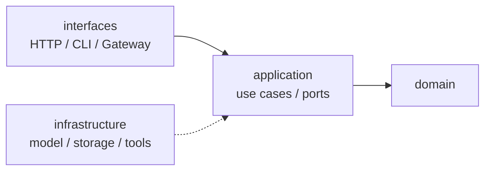

# agent

个人 Agent 运行时的雏形项目。

当前代码还处在基础骨架阶段：项目已具备 FastAPI 应用入口、应用配置、分层目录和 OpenAI 兼容模型适配器的初步实现，但 Agent 编排、HTTP 业务路由、CLI、RAG、Skills、Memory 等能力尚未接入。

## 当前状态

| 模块 | 状态 |
|------|------|
| FastAPI 应用 | 已有 `app/main.py`，提供 `/health` |
| 配置 | 已有 `config/app.py`、`config/model.py`、`config/config.py` |
| 模型适配 | 已有 application port、chat DTO、model router、模型供应商配置与 OpenAI provider 雏形 |
| HTTP API | 仅健康检查，业务路由待实现 |
| Agent / LangGraph | 待实现 |
| CLI / Gateway | 待实现 |
| RAG / Skills / Memory | 待实现 |

## 技术栈

| 类别 | 当前使用 |
|------|----------|
| 语言 | Python 3.14+ |
| Web | FastAPI + Uvicorn |
| 配置 | pydantic-settings |
| 模型调用 | OpenAI Python SDK |
| 包管理 | uv |

## 快速开始

```bash
uv sync
cp .env.sample .env
uv run python -m app.main
```

启动后可访问：

- 健康检查：[http://127.0.0.1:8000/health](http://127.0.0.1:8000/health)
- OpenAPI：[http://127.0.0.1:8000/docs](http://127.0.0.1:8000/docs)

健康检查响应：

```json
{
  "message": "ok"
}
```

## 目录结构

```text
agent/
├── app/
│   ├── application/
│   │   ├── dto/            # 用例层 DTO
│   │   ├── ports/          # 用例层端口协议
│   │   ├── commands/       # 命令对象预留
│   │   └── use_cases/      # 用例预留
│   ├── domain/             # 领域层预留
│   ├── infrastructure/
│   │   └── model/          # 模型路由与 provider 适配器
│   ├── interfaces/         # HTTP / CLI 等接口层预留
│   └── main.py             # FastAPI 入口
├── config/
│   ├── app.py              # APP_ 配置
│   ├── config.py           # 配置聚合
│   └── settings.py         # pydantic-settings 公共配置
├── storage/                # 本地运行时数据目录
├── paths.py                # 项目路径常量
├── pyproject.toml
└── uv.lock
```

## 配置

当前实际被应用入口读取的配置如下：

| 环境变量 | 默认值 | 说明 |
|----------|--------|------|
| `APP_NAME` | `agent` | 应用名称 |
| `APP_ENV` | `dev` | 运行环境 |
| `APP_DEBUG` | `true` | 是否开启 debug / reload |
| `APP_PORT` | `8000` | 服务端口 |
| `APP_DEPLOYMENT_MODE` | `personal` | 部署模式：`personal` 或 `server` |
| `APP_SERVICE_CODE` | `001` | 三位服务码 |
| `MODEL_TEMPERATURE` | `0.7` | 默认模型温度 |
| `MODEL_ALLOW_OVERRIDE` | `true` | 是否允许请求覆盖模型选择 |
| `MODEL_PROVIDERS_CONFIG_DIR` | 空 | 可选，供应商配置目录；为空时使用各 provider 包内配置 |
| `MODEL_PROVIDER` | 空 | 可选，运行时覆盖配置文件中的默认供应商 |
| `MODEL_NAME` | 空 | 可选，运行时覆盖配置文件中的默认模型 |

供应商连接参数和已选择模型会写入对应 provider 包内，例如 `app/infrastructure/model/providers/openai/provider_config.json`。也可以设置 `MODEL_PROVIDERS_CONFIG_DIR=storage/model-providers`，让运行时配置写到外部目录下的 `openai/provider_config.json`、`zai/provider_config.json`、`anthropic/provider_config.json`。示例结构参考根目录的 `model_providers.example.json` 和各 provider 包内的 `provider_config.example.json`。真实配置文件可能包含 API Key，默认不提交到 git。

## 已有模型适配骨架

当前模型调用相关代码位于 `app/infrastructure/model/`：

- `ModelRouter`：根据请求模型或对应 provider 包内的默认配置选择 provider
- `ModelProviderFactory`：创建并缓存 provider
- `OpenAIClient`：调用 OpenAI 兼容 Chat Completions API
- `ChatModelPort`：application 层使用的模型端口协议
- `ModelSetupService`：用于配置阶段校验供应商、拉取模型列表、保存多选模型

这部分还没有接入 HTTP endpoint。后续可以在接口层提供“选择供应商 -> 填配置 -> 验证 -> 选择模型 -> 保存”的配置流程。

## 架构约束

项目目标是保持清晰分层：



约定：

- `domain` 不依赖 `interfaces` 或 `infrastructure`
- `interfaces` 调用 `application`，不要直接调用模型 SDK 或未来的 LangGraph 编排
- `application` 通过 ports 描述外部能力
- `infrastructure` 实现 ports，并封装第三方 SDK
- 新增环境变量时，优先放入 `config/` 下的明确配置类，再更新 `.env.sample`

## 常用命令

```bash
uv sync
uv run python -m app.main
uv run black .
uv run ruff check .
```

## Roadmap

- 补齐 LLM 配置模块，并让模型网关可被用例层调用
- 新增 chat use case 与 HTTP endpoint
- 引入会话与消息领域模型
- 接入 Agent / LangGraph 编排
- 再逐步加入工具、RAG、Skills、Memory、CLI 和 Gateway
